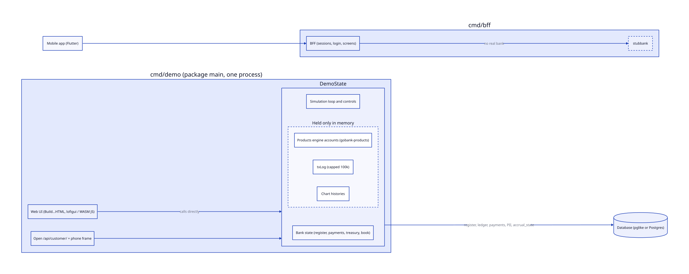
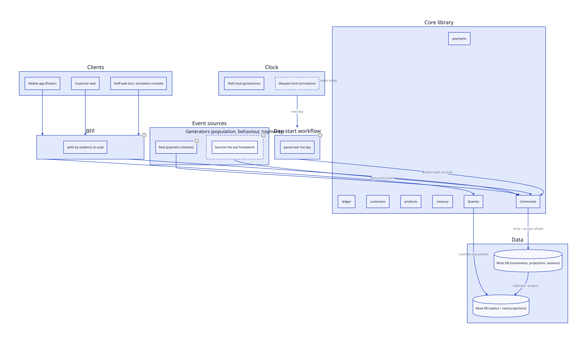
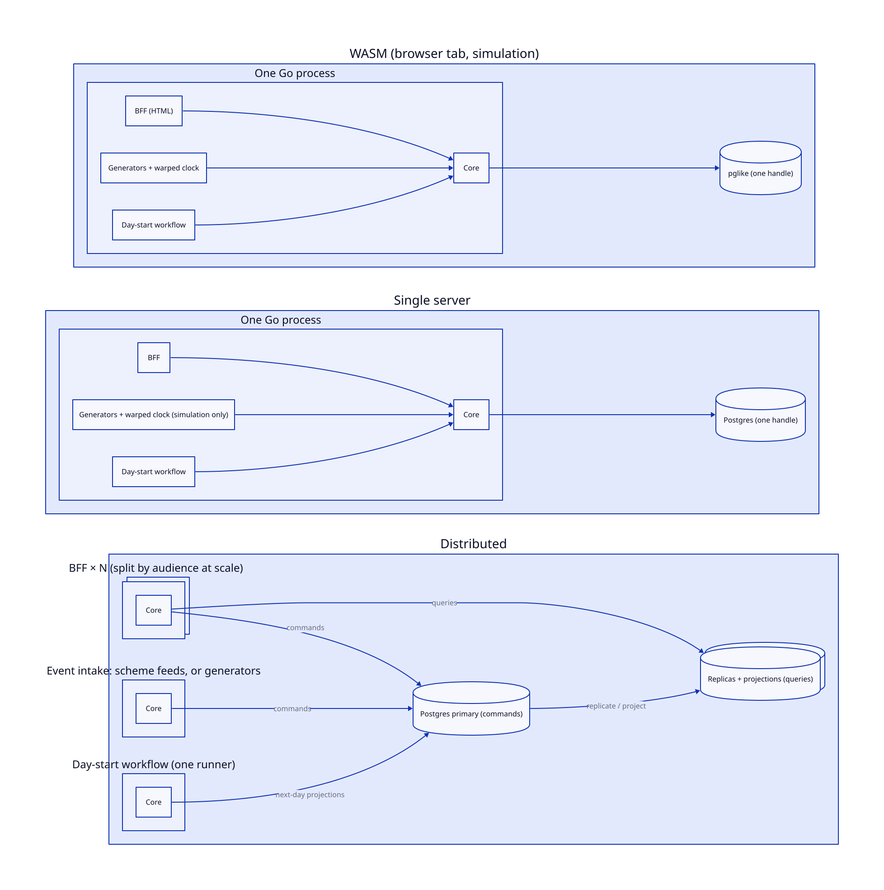

# ADR-0002: Target architecture and the transition to it

Status: Accepted
Date: 2026-10-02

## Context

GoBank is meant to be a banking core that runs anywhere from a browser tab
to many servers, with thin clients served by a backend-for-frontend, and a
simulation that exercises it. What exists is one program, `cmd/demo`, in
which those parts are fused:

- `DemoState` is the bank, the simulator and much of the UI at once: the
  simulation loop and its controls, chart histories, runtime limits, the
  WASM single-user PII toggle and the bank's state, behind two mutexes,
  with HTML builders (`Build…HTML`) hung off it in nearly every file.
- Part of the truth lives only in memory. The products engine
  (gobank-products `Simulation`) holds every account in a map and cannot be
  rebuilt from the database; customer transactions come from `txLog`, an
  in-memory log capped at 100k entries; chart histories are slices. The
  demo cannot restart and carry on, and no second process can read what
  the UI shows.
- Interest is an end-of-day batch: when the date advances the engine sweeps
  every account, posting an accrual movement and upserting accrual state
  for each, and nothing can read the new day until it finishes. go-luca was
  built for a different model — `RecordMovementWithProjections` writes a
  movement and that day's live balance in one transaction, and movements
  carry a value time and a knowledge time — but gobank uses none of it.
- The web UI renders straight from `DemoState`, in both the server and the
  WASM build. The mobile BFF (`bff`, `cmd/bff`) is real but serves a stub
  bank, because the bank is in `package main` of a separate module.

The demo works and is deployed, and must keep working throughout.

## Decision: the target

A simulation and a real bank are the same application. They differ only
in where events come from and how the clock is read.

What may call what:

**Clients.** The mobile app, the customer web app, and the staff web app
(today's demo UI: accounting, customers, payments, treasury, DB explorer,
and the simulation console).

**BFF.** One BFF serves every client: JSON for the app, HTML for both web
apps, from screen trees (`screen`). It holds no banking logic and no state
of its own; sessions live in the database, so a BFF can restart, or run as
many copies, without losing anything. At scale it splits by audience,
because app clients will far outnumber staff, but that split comes later
and changes only wiring.

**Core.** The bank as a library of components (ADR-0001), each exposing
commands (writes) and queries (reads). Every fact is stored in the
database; the engine is functions over the account a command has loaded,
not a map of all accounts. The core takes a write handle for commands and
a read handle for queries.

**Accruals are pipelined one day ahead.** A workflow starts at the
beginning of each day and works through every account, writing that
account's projection for the next day: its balance, its accrual, and any
interest application the product's rules call for on that day — daily for
some products, monthly or annually for others, so application is product
code inside the daily pass, not a separate month-end. An event that touches
an account during the day rewrites that account's projection. A read asks
for the day it wants and takes that day's projection, which already exists.
Reads therefore never wait on the pass, and the pass has the whole day to
run, paced; the per-account work remains but is spread across the day
instead of spiking at its end. Projection is one day ahead only: that gives
a day to do each day's work, and optimisations can project further later.

**Events and the clock.** Everything the bank does is in response to an
event: a customer action through the BFF, an incoming payment, the start of
a day. In a real deployment events come from clients and payment schemes,
and the clock is the wall clock. In simulation, generators produce the
events (a population, its behaviour, payment traffic) and the clock is
warped forward; the console that drives them is part of the staff web app.
Generators enter through the same entry points as real events, so the
simulation exercises exactly what a real deployment runs. They become the
scenario test framework, and a real bank simply has none.

**Data.** A write database for commands and a read database for queries.
Initially the read database is a full replica. Where there is one
database, both handles are the same.

### Rules

| Rule | Because |
|---|---|
| Every fact is stored in the database; anything held in memory is a cache that can be rebuilt | BFF restarts, multiple processes and read replicas all depend on it |
| No end-of-day spike: a start-of-day workflow projects every account one day ahead, and a read takes the projection for the day it wants | reads never wait on a batch; the work is paced over the day |
| The core is a library that the BFF embeds; the database is the only shared state | one codebase for every topology, with no core service to operate |
| Queries use the read handle, commands the write handle | read/write separation is a wiring choice, not a rewrite |
| Simulation differs from production only in event sources and the clock | the simulation tests the real system and can be removed from it |
| Topology lives only in `cmd/` wiring | the same packages run in every topology |

### Topologies

The same packages run in every topology; only the wiring in `cmd/`
differs. In the distributed topology every process embeds the core,
commands go to the primary and queries to the replicas, and the day-start
workflow has one runner.

### Choices made, and the alternative to each

| Choice | Alternative | Why this one |
|---|---|---|
| Core is an embedded library | a core service that the BFF calls remotely | no extra service or protocol; the database already serialises writers |
| A start-of-day workflow projects every account one day ahead | an end-of-day batch that reads wait for; or accruing an account only when it is touched | reads never wait; every account is visited daily so nothing drifts; a day of headroom for the work |
| Interest application is product code inside the daily pass | a separate month-end run | products apply interest on different cycles, so there is no single month-end |
| The engine loads the account a command needs | all accounts held in memory and reloaded at start-up | any number of processes can write; with projections stored, an account is a few rows |
| One BFF for app and web, split by audience later | separate BFFs from the start | one source for every screen until scale demands otherwise |
| Replicas are full copies of the database | projections tailored to the read side | simplest first; the read side specialises when data management arrives |

### Later

Data management and lifetimes, so the stored data stays bounded and a
WASM container can run continuously as the test bed for it. The kind of
data decides how it is trimmed: deltas (movements) need period opening and
closing postings when a period is retired, whereas counts and point values
can simply be dropped. Not part of this transition.

## Transition

Each stage ends with the demo running as it does today, in the browser
(WASM), on a single server and on the Hetzner deployment, with nothing
deleted that the demo still needs. Stages are in order; the work within a
stage is broken into stories when it starts.

| Stage | What changes | Done when |
|---|---|---|
| 1. Seams | Define the core's commands and queries as Go interfaces in a root-module package. `DemoState` implements them through an adapter; the web UI and the BFF, run in the demo process, call only through them. Nothing moves yet. | Contract tests run against the interfaces; the demo binary serves the app with real data |
| 2. Stored truth | Customer transactions become a ledger projection, replacing `txLog`; chart histories become stored daily snapshots; sessions move to the database. | Restarting the demo on Postgres resumes with the same transactions and charts |
| 3. Pipelined accruals | The end-of-day sweep becomes a start-of-day workflow that writes each account's next-day projection (go-luca write-time projections), with interest application as product code inside it; events rewrite the projection of the account they touch; reads take the projection for their day; the engine works on the account in hand. Needs gobank-products changes. | Reads during a day never wait on the workflow; the workflow is paced over the day and resumes after a restart |
| 4. Events and clock | Split `DemoState` into the bank and the simulation. Generators feed events through the stage 1 entry points; the clock is an injected source, warped in simulation. | No simulation code touches bank internals, and a test enforces it |
| 5. Core into packages | Move one component at a time (ledger, customers, products, payments, treasury) into root-module packages behind its API. Go's package boundary takes over ADR-0001's rule. | `cmd/demo` holds only wiring, generators and the UI |
| 6. One BFF | The staff UI renders through the BFF; the customer web renders through `screen`, replacing the demo's phone frame and its open `/api/customer/` endpoints. | The app and both web apps are served by the BFF; WASM runs it in the tab |
| 7. Read/write split | The core takes separate read and write handles; queries serve from a replica; a session reads its own writes. | Tests pass with one database and with two |
| 8. Many processes | gobank-deploy runs several BFFs, a generator process and one workflow runner against a primary and a replica. | Killing any BFF loses nothing; two BFFs serve the same customer consistently |
| 9. Simulation becomes tests | Scenarios drive the bank as tests; generators become optional. | A real-bank build compiles without them |

## Consequences

The phone can show real data at the end of stage 1, from the demo process
itself, long before the distributed target exists.

Stages 2 and 3 are the turning point. Until truth is stored and reads are
decoupled from the daily pass, every later stage would build on figures
that vanish on restart and on reads that wait for a batch.

Stage 3 does not shrink the per-account daily work; it moves it to the
start of the day and off the read path. The Hetzner demo's ten-minute days
are a throughput problem (one statement per account per day) and stay on
the roadmap as such.

gobank-products changes in stage 3: its engine stops being the system of
record and works on one loaded account at a time, over go-luca
projections, with interest application a per-product rule in the daily
pass.

The roadmap's Phase 2 step "Extract the banking core" is replaced by
stages 1 to 5. Phases 3 and 4 (Kubernetes, AlloyDB, CockroachDB) become
deployments of the stage 8 topology rather than separate builds.
