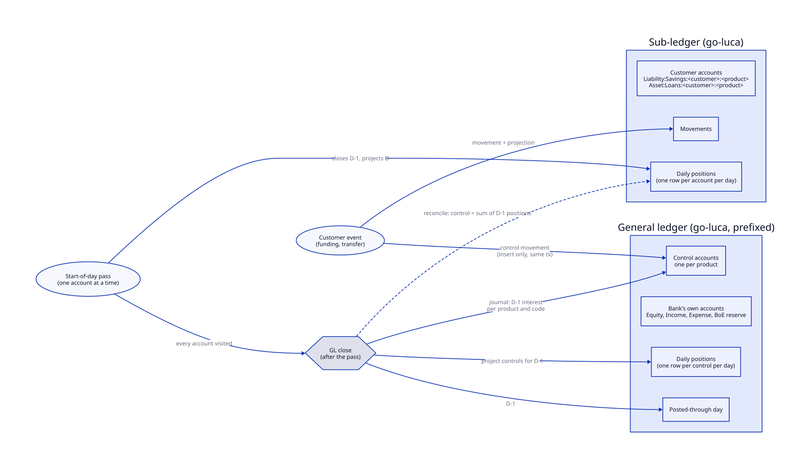
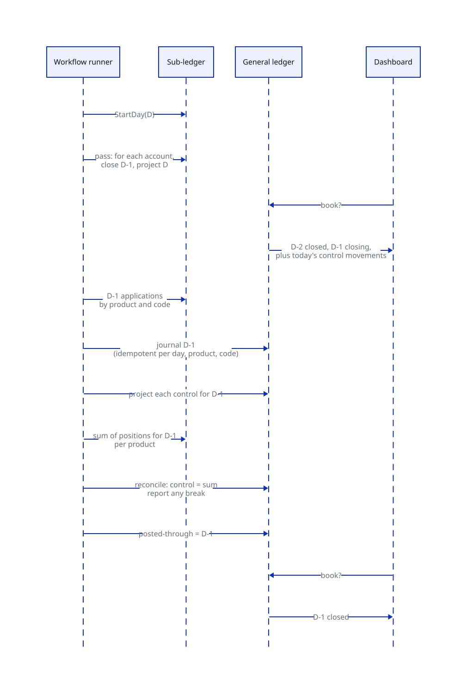

# ADR-0005: General ledger and sub-ledger

Status: Accepted
Date: 2026-10-08
Stage: ADR-0002 stage 6a, between 6 and 7

## Context

The bank keeps one ledger. Every customer account is a go-luca account at
`Liability:Savings:<customer>:<product>` or `Asset:Loans:<customer>:<product>`,
beside the bank's own accounts (equity, interest income and expense, the
BoE reserve). go-luca writes one position row per account per day, for
ever, and every interest application is a movement with one leg on the
bank's P&L account. The data therefore grows as accounts × days: at the
Hetzner scale, 120k accounts and 44M position rows a year.

The questions asked of it at bank level are per product: the book
(savings and lending per product), accrued interest per family, the P&L
and the balance sheet. Each is answered by summing the leaves. The book
is a sum over every account's live position, three correlated subqueries
each; accrued interest is a latest-day lookup per account; the P&L is a
scan of every interest application ever posted. That is why the P&L never
returns on the demo at 85k customers and the book reading takes seconds:
the data is shaped by accounts and days, the questions by products.

Banks separate these. The customer's account lives in a sub-ledger; the
general ledger holds a control account per product and the bank's own
accounts, is posted from the sub-ledger in aggregate, and the two are
reconciled rather than one derived from the other.

## Decision

Two go-luca ledgers in the one database, both stored, reconciled daily.

| Term | Meaning |
|---|---|
| Sub-ledger | Today's ledger, unchanged: customer accounts, their movements, their daily positions, and the bank-side accounts their double entry needs. The truth for the customer. Partitions by customer when the time comes. |
| General ledger (GL) | A small chart that never grows with customers: one **control account** per product, the bank's own accounts (equity, interest income and expense, the BoE reserve). The truth for the balance sheet and the P&L. |
| Control account | The GL account for a product; its balance is what the product's customer accounts sum to. |
| Journal | A posting from the sub-ledger to the GL in aggregate: one movement per product and code for a day's interest. |
| GL close | The GL's day end: the journal for the day, the GL's own positions projected, the reconciliation run, the posted-through day advanced. |
| Posted-through day | The last day the GL has closed. Every GL read says which day it is as of. |
| Reconciliation | Per product: the control account's closed position equals the sum of the sub-ledger's positions for that day. A break is reported, never hidden. |

### What posts to the GL, and when

| Sub-ledger event | GL posting | When | Touches the control row? |
|---|---|---|---|
| Funding, deposit, loan drawdown (equity ↔ customer) | equity ↔ the product's control | per event, in the event's transaction | no: a movement insert only |
| Transfer within one product | none | | |
| Transfer across products | control ↔ control | per event, in the event's transaction | no |
| Interest application | interest expense or income ↔ the product's control | one journal movement per product and code, at the GL close | no |
| Interest accrual | none: a position, not a movement | the GL close projects each control's accrued from the day's positions | once, by the close |
| BoE reserve accrual and receipt | GL only; the reserve leaves the sub-ledger | at the start of day, as now | once, single writer |

In-day GL postings are inserts only. A control account is one row shared
by every writer in its product, and projecting it per event is the
shared-row contention that froze v0.10.0. The GL's live position is its
closed position plus the day's control movements, which go-luca's live
view already computes: bounded by the day's events, not by the book.

### The GL close

The pass of day D closes day D-1: applications are value-dated at D-1's
last second and D-1's positions are final once the pass has visited
every account. The GL close follows the pass.

The journal is derived from the sub-ledger after the pass completes:
D-1's application movements grouped by product and code, written
idempotently per (day, product, code). It is not accumulated while the
pass runs, so a restart mid-pass loses nothing and the account stays the
unit of work. The reconciliation then compares the control's closed
position with the sum of the sub-ledger's positions for D-1: the journal
posts movements, the reconciliation compares positions, so the GL is
posted from facts and checked against other facts, not copied.

**The GL is behind by the length of the pass, and that is the contract.**
During the first minutes of D the GL shows D-2 closed, D-1 closing, and
today's customer events already on the controls. The only thing not yet
there is D-1's interest, which lands as one journal. A bank's overnight
run publishes yesterday's close in the morning the same way. The number
that decides whether this matters is the pass duration at scale (under
two minutes at 120k accounts on dedicated cores, under five shared); if
the pass grows to hours the fix is pass throughput, not a live GL.

### What each read reads

| Read | Source | As of |
|---|---|---|
| A customer's balance, transactions, statement | sub-ledger | live |
| The book: savings and lending per product; lending headroom | GL controls, live position | closed day plus today's control movements |
| Accrued interest per family | GL controls, closed position | the posted-through day |
| P&L, balance sheet | GL | closed day plus today's movements |
| History series | the GL's closes | one point per closed day |
| "Closing D-1", pass progress | the run record | live |

The daily snapshot moves from the start of day to the GL close: the GL's
end-of-day position for D-1 is the snapshot, labelled with its day.

### Choices made, and the alternative to each

| Choice | Alternative | Why this one |
|---|---|---|
| Two ledgers | roll-up accounts inside the one ledger | roll-ups double every write onto hot parent rows and keep every daily row in the GL: neither problem is fixed |
| Journal at the close, derived from the sub-ledger | journal per account during the pass, or per batch of accounts | per account puts every application on one control row; per batch makes the batch the unit of restart, which the no-batching rule forbids |
| In-day control movements are inserts, projected once at the close | project the control per event | a shared row under parallel writers |
| The GL lags by the pass | a live GL | a live GL needs one of the two rejected journals; the lag is what banks already accept |
| Both ledgers stored and reconciled | the GL as a cached view over the sub-ledger | a derived GL cannot be reconciled, only recomputed; the reconciliation is the control a bank runs |

## Transition

Stage 6a of ADR-0002, between One BFF and the read/write split, so that
stage 7 rewires reads that are already cheap. Stories:

1. go-luca enablers (go-luca #8, #9): a second ledger in one database (a table and view
   prefix on `NewSQLLedger`), and indexes for day-bounded reads
   (movements by value time, positions by day) so the journal and the
   reconciliation scan a day, not the table.
2. The GL opened and posted in shadow: the chart, per-event control
   movements in the event's transaction, the journal and the GL close at
   pass completion, the posted-through day, the reconciliation reported
   on the dashboard. Reads unchanged. A bank already running when the GL
   opens is adopted: the GL records its opening day, and its first close
   takes each control's opening balance from the sub-ledger's positions
   instead of journalling, so the reconciliation holds from the first
   day. Done when preprod closes days with no break.
3. Reads move to the GL: the book, accrued interest, the P&L and balance
   sheet, the history series and lending headroom, each labelled with its
   day; the snapshot taken at the close; the BoE reserve moves to the GL.
   Customer reads stay on the sub-ledger.

Each story is released, deployed and drilled before the next, as the
transition rule says.

## Consequences

Easier: bank-level reads are a handful of rows whatever the book; the
P&L and the balance sheet are a GL read; the history series is the GL's
closes. The sub-ledger is free to retire daily positions older than it
needs (ADR-0002's data management) because the GL never needed them, and
to partition by customer later because nothing bank-level sums it.

Harder: a second chart to open, two go-luca ledgers to migrate in the
upgrade drill, and a reconciliation that can break and must be shown.
Dashboard figures carry a day and lag the pass by minutes; stated policy,
as ADR-0004's second-old totals are.

Given up: one ledger that is the whole truth. The sub-ledger is the truth
for the customer, the GL for the bank, and the reconciliation is where
they meet.
