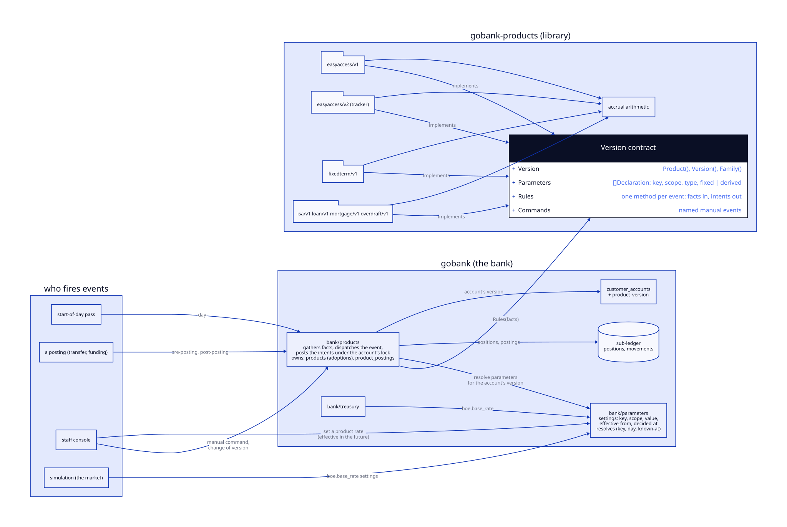

# ADR-0006: Products as versioned code, with bitemporal parameters

Status: Accepted
Date: 2026-10-09, accepted 2026-10-10
Stage: ADR-0002 stage 8 of Phase 2 (roadmap 1.8), taken before 1.7.2 and 1.7.3

## Context

A product today is a gobank-products value (id, name, family, a feature
list, a string map of defaults) wrapped by `bank/products` with a
`float64` rate and a blurb. An account records only a product id. The
day rule (`NextDay`, pure, over go-luca positions) is right, but what it
is asked to apply is not a record: the rate lives in the wrapper, the
cycle in a string map, and the feature-and-event framework in
gobank-products is a second mechanism the bank does not run (the bank
enforces no term lock, ISA allowance or overdraft limit at all). Nothing
says which rules an account was on when a posting was made, so a rate
change would rewrite the past, and the Bank of England base rate is a
function the simulation injects, read by the treasury and shown on the
dashboard but connected to no product.

Three things are wanted. Each product version is a unit of code with
its own tests, called by the bank at a fixed set of events. A rate is a
parameter in a hierarchy, with a product rate possibly derived from a
bank-wide one (base rate less 15 basis points, floored). Parameters are
bitemporal: a change can be decided now and take effect on a future day,
and the bank can say what it knew when.

## Decision

A product version is a Go package in gobank-products. The bank runs it
through one event contract, stores what it has adopted, resolves the
version's parameters from a bitemporal settings component, and records on
every rule posting the version and the values that produced it.

| Term | Meaning |
|---|---|
| Product | What the bank sells: an identity (`easy-access`) and a family. Nothing else; all behaviour is in a version. |
| Version | One product's rules at one point in its life: a package `easyaccess/v1`, `easyaccess/v2` in gobank-products. Declares the parameters its rules read and answers each event. Immutable once adopted: a change to the rules is a new package. A golden per version pins it. In the build only while it is on sale or an account runs on it. |
| Adoption | A version's up migration: the adoption row written, its parameters published, any account-scoped parameter it needs declared. Additive. |
| Withdrawal | A version's down migration: off sale, refused while any account runs on it. Additive too: nothing the version posted is touched. |
| Retirement | The package deleted from gobank-products once withdrawn and no account runs on it. Its postings and their records stay for ever. |
| Rule | A version's answer to one event: a method from facts to intents, pure. |
| Event | Something the bank tells a version has happened: to one account, or to the version itself. The set is fixed by the contract (below). |
| Facts | What a rule may read: the account's positions and balance, the movement in hand, the day, and its parameters resolved for that day. Read through an interface the runner implements and tests fake. |
| Intents | What a rule may ask for: positions to project, postings to make, a refusal with its reason, a value to record. The runner carries them out; a rule writes nothing. |
| Parameter | A named, typed value a rule reads: rate in basis points, floor, application cycle, day-count basis, term. Declared by the version with a scope and a source. |
| Scope | Whose parameter it is: the bank (`boe.base_rate`), a product version (`easy-access/v1/rate_bps`), or one account (`maturity_day`). |
| Setting | One stored value of a parameter: value, effective-from (value time), decided-at (knowledge time), who. Append-only. The bitemporal record. |
| Derivation | A parameter defined as a function of another: `bank.savings_rate − 15 bps, floor 0`. Code, not a setting; a derived parameter has no settings of its own. A derivation may lag: the lower (or higher) of the source now and the source a number of days ago. |
| Bank rate | The bank's own base rate for a family, `bank.savings_rate_bps` and `bank.lending_rate_bps`: derived from the Bank of England rate with a spread and a lag, by the bank's policy. What a product rate derives from, unless the version has logic of its own. |
| Policy | The bank's rules as versioned code: a package in gobank-products that declares the bank-scoped parameters (the base rate as the market writes it, the bank rates, the spreads and lags). Adopted, immutable and retired as a product version is; a change to how the bank sets its rates is a new policy version. |
| Catalogue | The versions the bank has adopted: the `products` table, with the day each went on sale, the gobank-products module version that carried it, and its parameters as published. |
| Account version | The version an account runs under: stamped at open, changed only by the change-of-version event. |
| Rule posting | A ledger movement a rule called for, recorded with the version, the event and the resolved parameters that produced it. |

### Rule change against value change

A version is immutable, and a parameter is changeable by a setting; the
line between them is the line between a rule and a value. Moving easy
access from 1.50% to 1.35% is a setting on `easy-access/v1/rate_bps`
effective on a day, decided today, and no new version. Moving easy
access from a fixed rate to a tracker on the base rate is a change of
rule, so it is `easyaccess/v2`, and accounts stay on v1 until moved.
The test for which is which: could the old and the new be told apart
by reading the code? If yes, it is a version.

### Versions in the build: up and down

The build carries only the versions the bank has: those on sale and
those an account runs on. A version is not kept for ever because its
code once ran. Each version package ships its own migration pair, and
the bank's migration applies them as it does any component's
(ADR-0003, the upgrade drill):

| Step | What it does | Refused when |
|---|---|---|
| Up (adoption) | writes the adoption row with the day, the module version and the published parameters; declares any account-scoped parameter the version needs | the product has a later version on sale |
| Down (withdrawal) | marks the adoption withdrawn, so no account opens on it | any account runs on it |

Both are additive: no row is deleted, no posting touched. The drill's
rollback is the older build serving again, as today, and an older build
may meet accounts on a version it does not carry. It leaves them alone:
the pass reports them as unprojected and does not run them, a posting
to them is refused, and the console shows the count. Nothing is lost,
because every fact is in the database, and the forward build picks the
accounts up where it left them.

What the database keeps when a version is retired is therefore the
whole of it: every movement the version posted (the ledger is append-
only) and every rule posting record. The record must stand without the
code: it carries the version, the event, the resolved parameters and
the inputs the rule applied them to (the position it closed, in
numerator units). Verifying an old posting is arithmetic over the
record (applied pence = the numerator over `AccrualDenominator`,
truncated), which the engine package keeps for ever; it never needs the
version's rules back.

### The events

| Event | Fired by | The rule reads | The rule returns | v1 of every product |
|---|---|---|---|---|
| Start-up | the bank, once per process per adopted version | the published parameters, the bank's settings | ok, or a refusal (a parameter unresolvable, a derivation source missing) that stops the bank | checks its parameters resolve |
| Open | `OpenCustomer`, `OpenAccount` | the open day, the parameters | account-scoped settings to write (a term product's maturity day), the first position | savings and loans: the position; fixed term: the maturity day |
| Pre-posting | payments, before a movement posts | the movement, the position, the parameters | allow, or refuse with a reason | fixed term: refuse withdrawals before maturity; ISA: refuse deposits over the allowance; overdraft: refuse debits past the limit |
| Post-posting | payments, after a movement posted (today's `PostEvent`) | the closing balance, yesterday's position | today's position | `Accrue` on the closing balance |
| Day | the start-of-day pass (today's `AccountDay`) | yesterday's position, the closing balance, parameters for yesterday and today | yesterday closed with its postings, today's position | `Apply` of yesterday then `Accrue` today |
| Parameter change | the parameters component, when a setting the version reads becomes effective | the old and new value | nothing, or postings | nothing: the day rule reads the new value from its effective day |
| Manual command | the staff console, by name from the version's command list | the position, the parameters | postings, the position | `apply-interest`: apply the accrual now, off cycle |
| Change of version | the staff console, per account | both versions' parameters, the position | the outgoing version closes its cycle (postings), the incoming takes over | the outgoing applies accrued to date; the incoming starts a fresh accrual |
| Close | `CloseAccount` | the position | the final postings | apply accrued to date |

Every event runs under the account's lock, in the caller's transaction,
and is the same however often it runs: the facts it reads are stored,
the intents it returns are functions of them. That is what lets the pass
resume after a restart and an event follow the pass, as today, and it is
why a rule reads through an interface and returns intents rather than
holding a ledger handle. The feature framework held a ledger handle, and
the bank never ran it.

### The bank's rates

The Bank of England announces a change before it takes effect, so its
setting is decided before it is effective. The bank does not pass the
change straight through: a cut reaches savers at once and a rise after a
delay, and for borrowers the other way about. The product rate then
follows the bank rate on the same day, at a fixed spread below it.

The policy expresses this as derivations, not as a daily rule that
writes settings. A lagged derivation reads its source on the day and a
lag of days earlier and takes the lower (savings) or the higher
(lending), so the bank rate on any day, past or future, is a function of
the base-rate series and nothing else:

| Family | Base rate moved | Bank rate on day d | Reaches the customer |
|---|---|---|---|
| savings | down on d0 | min(base(d), base(d − lag)) + spread: the new, lower rate from d0 | at once |
| savings | up on d0 | the old rate until d0 + lag, then the new | after the lag |
| lending | up on d0 | max(base(d), base(d − lag)) + spread: the new, higher rate from d0 | at once |
| lending | down on d0 | the old rate until d0 + lag, then the new | after the lag |

The spreads and lags are bank-scoped parameters with published values,
changeable by setting: the bank that chooses not to pass a cut on widens
its savings spread by the cut from the cut's day, and the derivation does
the rest. Because every rate resolves for a future day, the products
page shows the rate a product will pay in two weeks, and the parameter
change event fires on the day it lands with nothing scheduled.

A product version's rate derives from the bank rate by default:
`rate_bps = bank.savings_rate_bps − 15, floor 0`. A version with logic
of its own publishes a fixed rate instead (the v1 packages, which
reproduce the rates the bank ran before), or answers the parameter
change event in its own way.

### Parameter resolution

A rule asks for parameter P on day D. The runner resolves it as known at
K, which is now for every event the bank runs; a correction (a setting
decided later with an earlier effective day) produces an adjustment
posting under a later event, never a rewrite, because the rule posting
recorded the value used.

| P is derived | P's scope | A setting with effective ≤ D and decided ≤ K exists | Outcome |
|---|---|---|---|
| yes | | | resolve the source at (D, K) and, if lagged, at (D − lag, K), take the lower or higher as declared, apply the formula: spread, then floor and cap |
| no | account | yes | the setting with the greatest effective-from; of equals, the latest decided |
| no | account | no | refuse: the open event failed to write it |
| no | product version | yes | as the account row |
| no | product version | no | the published value from the adoption record |
| no | bank | yes | as the account row |
| no | bank | no | refuse at start-up: the bank cannot run without its base rate |

A setting with effective-from after D is invisible to D: that is how a
future rate change is known and shown (the products page lists upcoming
settings) and takes effect on its day with nothing to do. The base rate
is a bank-scoped parameter whose settings the simulation writes through
a core command, one per change in its historical series, decided on the
day it took effect; `core.BaseRateSource` goes, and the treasury's
reserve accrual reads the parameter. A rate may be negative: the
accrual arithmetic is signed already (`RateBps` rounds a negative rate,
the numerator goes negative, `Apply` truncates toward zero), and the
runner posts a negative application in the reverse direction.

### Storage

| Table | Owner | Rows |
|---|---|---|
| `products` | bank/products | one per adopted version: product, version, adopted day, withdrawn day, module version, published parameters. The latest adopted and unwithdrawn version of a product is the one new accounts open on. |
| `product_postings` | bank/products | one per rule posting: the movement, the account, product, version, event, the resolved parameters as text, the inputs applied (the closing numerator and the balance) |
| `parameter_settings` | bank/parameters | one per setting: scope, key, value, effective-from, decided-at, decided-by |
| `customer_accounts.product_version` | bank/customers | the account's version; the migration puts every open account on 1 |

The rule posting is a bank table and not go-luca batch metadata because
it is the bank's record of why it posted, read by the bank's pages and
reconciled against the movement, and because go-luca's `UserData64` is
one integer where three values and a parameter list are needed.

### Choices made, and the alternative to each

| Choice | Alternative | Why this one |
|---|---|---|
| A package per version | one package per product with `V1`, `V2` values in it | a version is edited by nobody after adoption; a package boundary makes that a directory nothing else shares, and the golden the only thing that need change |
| The version as a per-product integer, the module version recorded on adoption | the gobank-products module version as the product version | several versions must coexist in one build for an account to be moved between them; the module version is provenance, not identity |
| Rules read facts through an interface and return intents | the version holds a ledger handle and posts | each version tests with no database; idempotence under restart needs rules to be functions of stored facts; the shared-row lesson of v0.10.0 |
| Rate as a parameter with settings, rule as a version | every change a new version | a rate move is the commonest change a bank makes and must be decidable today for a future day without a release |
| Derivation in the version's code | a formula stored as a setting | code is the definition; a formula in a string is a product designer, which is out of scope |
| The bank's rates as lagged derivations in a policy package | a daily bank rule that answers each base-rate change by writing settings | a derivation is a function of the series, so it resolves for any day, needs no record of which changes it has answered, and runs the same after a restart; discretion is a change to the spread or the lag |
| The base rate a bank parameter the simulation writes | keep `BaseRateSource` and mirror it | one mechanism; stage 9's tests write a setting the same way |
| A `product_postings` table | go-luca batch metadata | above |
| The events dispatched by `bank/products` | each caller resolves the version and dispatches | one place resolves the account's version, its parameters and the lock; callers name the event |
| Versions leave the build when retired; the record stands alone | every version kept for ever | a bank runs the products it has; a retired version's rules are only ever asked to verify what they posted, and the record answers that |
| Adoption and withdrawal as the version's own up and down migrations | adoption by a console command | the upgrade drill already applies and rolls back migrations; a version arrives and goes the way a table does |

Out of scope: a product designer, products as data, bulk migration of a
book between versions (the per-account event is in; the tool over it is
not), notice periods, corrections as adjustment postings (the record
that makes them possible is in), per-account rate overrides (the account
scope exists for term facts; a negotiated rate is a later use of it).

## Transition

Stage 8 of ADR-0002, taken before the rest of stage 7 because the
version stamp and the parameter record are what the permissions work
will show and gate. Stories, each released and (where the bank changes)
deployed and drilled before the next:

1. **gobank-products: the contract and v1 of every product.** `Version`,
   `Facts`, the events and intents, parameter declarations with scope
   and derivation, from which the bank derives each version's up and
   down (a version carries nothing more until one needs to); six
   `<product>/v1` packages that reproduce today's behaviour exactly, the
   bank's `float64` rates moving in as published basis points; the
   goldens re-pinned per package; the feature framework, `SimContext`,
   `Simulation` and `ParameterStore` retired. A library release; gobank
   stays on v0.3.0 until the next story.
2. **The catalogue and the runner.** `products` and `product_postings`,
   `product_version` on accounts, `bank/products` dispatching open,
   post-posting, day and close to the account's version, and leaving
   accounts on a version the build lacks unprojected and counted; the
   `float64` rate and the defaults map gone from the bank; the products
   page showing versions and the accounts on each. Drilled: the
   migration applies the six ups and stamps every account 1; the
   rollback build runs with the rows in place.
3. **Parameters.** `bank/parameters` with its settings and resolution;
   the policy package (`policy/v1` in gobank-products: the base rate as
   the market writes it, the bank savings and lending rates derived with
   spread and lag, lagged derivations in the contract) and its adoption;
   the base rate written by the simulation and read by the treasury; a
   staff page that sets a product rate or a bank spread effective on a
   future day; `easyaccess/v2` tracking the bank savings rate (− 15 bps,
   floor 0) adopted on preprod mid-run, with new accounts opening on it
   and its accrual seen moving, at once on a cut and after the lag on a
   rise, when the base rate does.
4. **The remaining events.** Pre-posting (the term lock, the ISA
   allowance, the overdraft limit become rules the payments path asks),
   parameter change, start-up, manual commands from the console, change
   of version per account from the staff account page. Done-when of the
   stage: an account moved from easy-access v1 to v2 on preprod, its v1
   cycle closed by postings that record v1.

## Consequences

Easier: a product change is a package with a golden, reviewed as code;
a rate change is a row with a date; every posting says why it was made;
the simulation's base rate and a real bank's are the same mechanism;
stage 9's scenario tests drive a version directly.

Harder: three tables where there was none, a module whose API changes
wholesale, and a runner that must resolve a version and its parameters
before every event. Reading a parameter is a query where it was a field;
story 3 measures it on the pass and caches per (version, day) if the
pass slows.

Given up: one product value with everything on it. The product is three
things now, a package, an adoption row and a settings series, and the
bank knows the difference.
